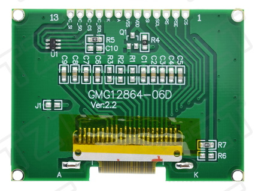

# Luatos_ESP32_C3_Core_DIO_SSD1309_I2C_128x64

Aliexpress I2C Display ~3€, tested with Luatos ESP32 C3 Core ~3€ 

Tested with Arduino IDE 2.0.4 and u8g2 library by olikraus.


My display connector is marked with "GME12864-70".

## Arduino IDE configuration
- Board: "ESP32C3 Dev Module" 
- Flash Mode: "DIO"

## Connections for Luatos ESP32 C3 Core

| TFT  | GPIO |         | 
| :--- | ---: | :------ |
| SDA  | 8    | I2C SDA |
| SCL  | 9    | I2C SCL |
| VDD  |      | 3.3V    |
| GND  |      | GND     |

> Pinout of my Luatos ESP32 C3 Core as i found out : 


## Initialization of the library u8g2 2.33.15
GraphicsTest_Luatos_C3_Core_DIO_SSD1309_I2C_128x64.ino :
```c++
#include <Arduino.h>
#include <U8g2lib.h>

#ifdef  U8X8_HAVE_HW_SPI
#include <SPI.h>
#endif
#ifdef U8X8_HAVE_HW_I2C
#include <Wire.h>
#endif

U8G2_SSD1309_128X64_NONAME2_F_HW_I2C u8g2(U8G2_R0, /* reset=*/ U8X8_PIN_NONE); 

//...

void setup(void) {
  //Speedtest : Arduino\libraries\U8g2\examples\full_buffer\FPS\FPS.ino
  //u8g2.setBusClock( 400000); // 31.6 FPS (default)
  //u8g2.setBusClock(1000000); // 58.2 FPS
  u8g2.begin();
  u8g2.setContrast(CONTRAST);  // Necessary for GMG12864-06D 
}

//...
```
> This u8g2 drivers for I2C and SPI are using Hardware I2C (SPI), so i must use the Pins in the pinout shown above. 

## Luatos ESP32 C3 Core with **SPI** display GMG12864-06D



Connections for LCD Display GMG12864-06D Ver:2.2

| TFT  | GPIO |                 |
| :--- | ---: | :-------------- |
| SI   |    6 | SPI MOSI        |
| SCL  |    4 | SPI SCLK        |
| CS   |    7 | CS              |
| RS   |   19 | DC              |
| RSE  | REST | REST Pin        |
| VDD  |      | 3.3V            |
| VSS  |      | GND             |
| A    |      | LED A -> 47Ω -> 3.3V |
| K    |      | LED K -> GND         |

The Pin A of the TFT (backlight LED) is connected via a 47Ω resistor to 3.3V. RSE ( TFT reset pin ) is connected to the REST pin of the Luatos ESP32 C3.


Initialization :
```c++
#include <Arduino.h>
#include <U8g2lib.h>

#ifdef  U8X8_HAVE_HW_SPI
#include <SPI.h>
#endif
#ifdef U8X8_HAVE_HW_I2C
#include <Wire.h>
#endif

U8G2_ST7565_ERC12864_ALT_F_4W_HW_SPI u8g2(U8G2_R0, /* cs=*/ 7, /* dc=*/ 19, /* reset= */ U8X8_PIN_NONE);  
#define CONTRAST 75            // don't forget

//...

void setup(void) {
  //Speedtest : Arduino\libraries\U8g2\examples\full_buffer\FPS\FPS.ino
  //#define  BUSCLOCK 40000000  // 228.5 FPS (default)
  //#define  BUSCLOCK 80000000  // 241.3 FPS
  u8g2.begin();
  u8g2.setContrast(CONTRAST);  // Necessary for GMG12864-06D 
}

//...

```

<!-- unvisible -->
