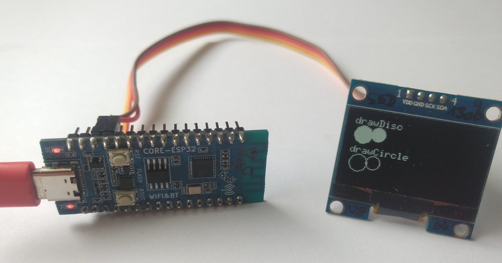
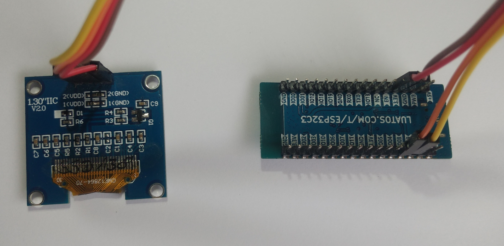
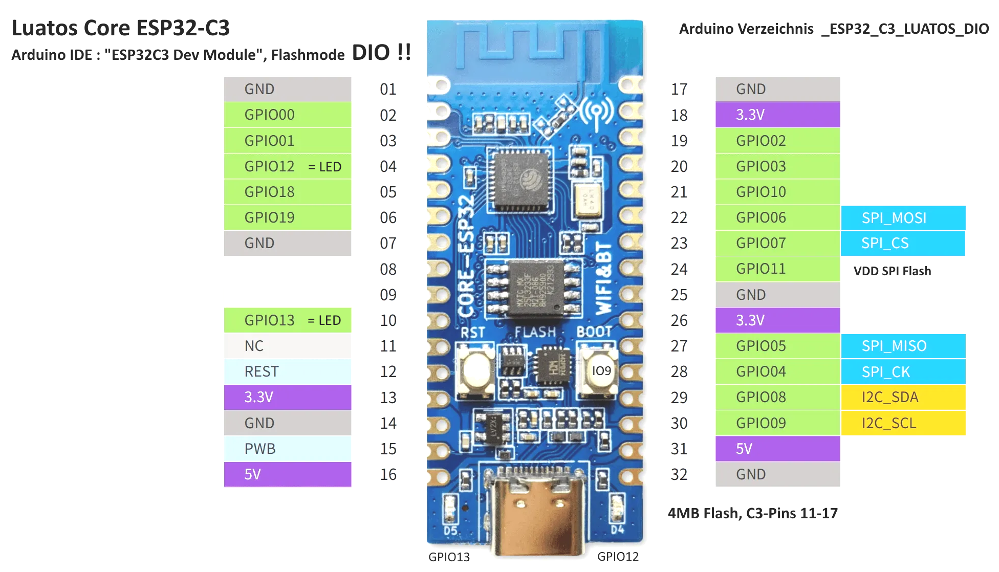

# Luatos_ESP32_C3_Core_DIO_SSD1309_I2C_128x64

Aliexpress Display ~3€, tested with Luatos ESP32 C3 Core ~3€ 

Tested with Arduino IDE 2.0.4 u8g2 library by olikraus





My display connector is marked with "GME12864-70".

# Arduino IDE
- Board: "ESP32C3 Dev Module" 
- Flash Mode: "DIO"

# Connections for Luatos ESP32 C3 Core

|          | GPIO | TFT   |
| :------- | ---: | :---- |
| I2C SDA  |  8   | SDA   |
| I2C SCL  |  9   | SCL   |
| 3.3V     |      | VDD   |
| GND      |      | GND   |

Pinout of my Luatos ESP32 C3 Core as i found out :



# Initialization of the library u8g2
GraphicsTest_Luatos_C3_Core_DIO_SSD1309_I2C_128x64.ino :
```
#include <Arduino.h>
#include <U8g2lib.h>

#ifdef U8X8_HAVE_HW_SPI
#include <SPI.h>
#endif
#ifdef U8X8_HAVE_HW_I2C
#include <Wire.h>
#endif

// ESP32 C3 CORE LUATOS : 1.3" OLED IIC V2.0. SSD1309
U8G2_SSD1309_128X64_NONAME2_F_HW_I2C u8g2(U8G2_R0, /* reset=*/ U8X8_PIN_NONE); 
...
```
This driver uses Hardware I2C. 

# Testing the Luatos ESP32 C3 Core with SPI display GWG12864-06D
LCD Display GWG12864-06D

|                 | GPIO | TFT   |
| :-------------- | ---: | :---- |
| SPI MOSI        |  6   | SI    |
| SPI SCLK        |  4   | SCL   |
| CS              |  7   | CS    |
| DC              | 19   | RS    |
| Reset           | REST | RSE   |
| 3.3V            | 3.3V | VDD   |
| GND             | GND  | VSS   |
| Led 47Ω -> 3.3V | 47Ω  | A     |
| Led GND         | GND  | K     |

The Pin A of the TFT ( backlight ) is connected via a 47Ω resistor to 3.3V. RSE ( TFT reset pin ) is connected to the REST pin of the Luatos ESP32

Initialization :
```
...
//U8G2_ST7565_ERC12864_ALT_F_4W_HW_SPI u8g2(U8G2_R0, /* cs=*/ 7, /* dc=*/ 19, /* reset=*/ U8X8_PIN_NONE);  
...
```
