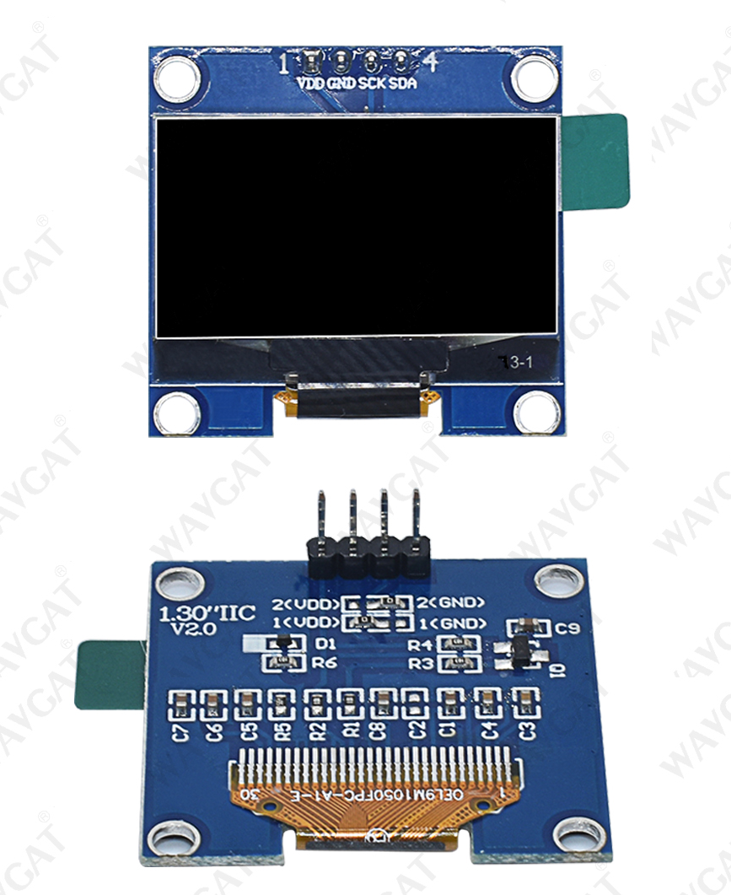

# Luatos_ESP32_C3_Core_DIO_SSD1309_I2C_128x64

Aliexpress Display ~3€, tested with Luatos ESP32 C3 Core ~3€ 

Tested with Arduino IDE 2.0.4 u8g2 library by olikraus

My display connector is marked with "GME12864-70".

# Connections

|          | GPIO | TFT   |
| :------- | ---: | :---- |
| I2C SDA  |  8   | SDA   |
| I2C SCL  |  9   | SCL   |
| 3.3V     |      | VDD   |
| GND      |      | GND   |

# Arduino IDE

- Board: "ESP32C3 Dev Module" 
- Flash Mode: "DIO"

